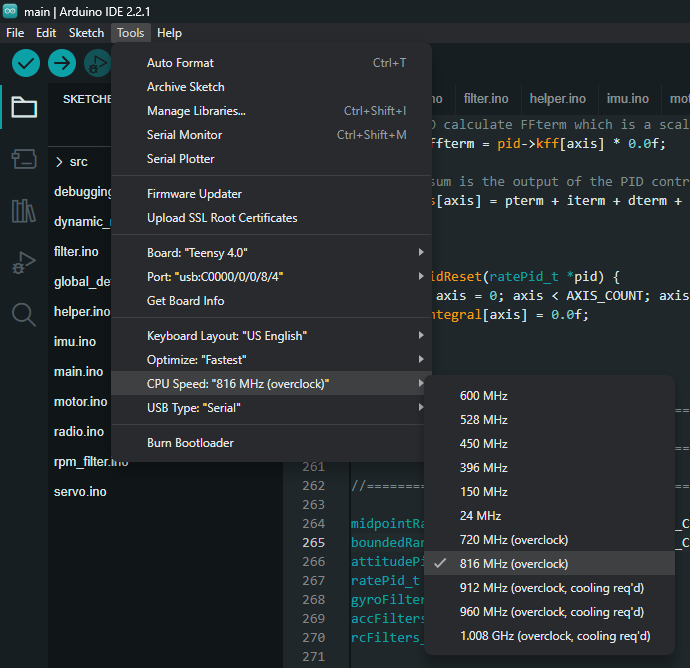
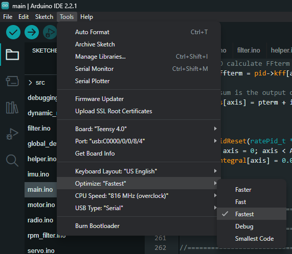

# QuickDrehm

A heavily modified fork of dRehmFlight that offers flight performance improvements. Adds RPM filtering, and dynamic notch filtering.

## Overview

QuickDrehm is the flight controller for hobbyists, hackers, and non-coders interested in stabilizing their wacky and unique flying creations. The code and supporting documentation is built to bring someone up to speed on VTOL flight stabilization concepts as quickly and painlessly as possible. The code is written and presented in a way that is intuitive, and easy to follow. No more digging through countless folders and confusing classes just to add an 'if' statement for your custom drone application. This flight controller uses a Teensy 4.0 microcontroller, so there is no confusing flashing or compiling process necessary. If you can use Arduino, you can start expanding the capabilites of this flight controller to your liking.

QuickDrehm has been used as a teaching tool for aircraft stabilization and flight control principles at Utah State University. It is meant to out-perform dRehmFlight with a small amount of added complexity. It is not menat to be used in a commercial sense. It is best suited for rapid prototyping or allowing radio control hobbyists and students get their feet wet in flight control code for their fixed wing, multirotor, or VTOL project. More information to come.

This code is entirely free to use and will stay that way forever. If you found this helpful for your project, donations are appreciated: [Paypal Donation](https://www.paypal.me/NicholasRehm)

### Hardware Requirements
This flight controller is based off of the Teensy 4.0 microcontroller and MPU6050 6DOF IMU. The following components (available on Amazon) are required to complete the flight controller assembly:

**Teensy 4.0**: https://amzn.to/3oFG3QN

**Alternative Links**: [Sparkfun](https://www.sparkfun.com/products/15583), [Adafruit](https://www.adafruit.com/product/4323), [Electromaker](https://www.electromaker.io/shop/product/teensy-40?gclid=Cj0KCQjwxIOXBhCrARIsAL1QFCYcZsU4tRXVgeqfOOJyg_zPV2MXTeJM2QwJ6zafMTsCb6MjWthk7r8aAn6hEALw_wcB)

Due to supply chain issues, the Teensy 4.0 has been frequently out of stock throughout 2022. The Teensy 4.1 is generally in stock more often and is immediately compatible with the dRehmFlight pin mappings (plus you get extra bonus pins!): https://amzn.to/3c1OSSw

**GY-521 MPU6050 IMU**: https://amzn.to/3edF1Vn

These (and all Amazon links contained within the supporting documentation) are Amazon Affiliate links; by purchasing from these, Nickolas Rehm receives a small portion of the revenue at no cost to you. I appreciate any and all support!

### Software Requirments
Code is uploaded to the board using the Arduino IDE; download the latest version here: https://www.arduino.cc/en/main/software

To connect to the Teensy, you must also download and install the Teensyduino arduino add-on; download and instructions available here: https://www.pjrc.com/teensy/td_download.html

Additionally to get the Teensy4.0 to function it must be overclocked to 816mhz (it appears to be a bug and I'd happily accept a PR to fix it).

Set the optimization to fastest to give yourself the most headroom with your code.

## Tutorial Videos

TODO

## Flight Videos
QuickDrehm has been successfully implemented on the following platforms:

**Canard wing VTOL:** https://youtu.be/Vh7gCGENEaE

## Disclaimer
This code is a shared, open source flight controller for small micro aerial vehicles and is intended to be modified to suit your needs. It is NOT intended to be used on manned vehicles. I do not claim any responsibility for any damage or injury that may be inflicted as a result of the use of this code. Use and modify at your own risk. More specifically put:

THIS SOFTWARE IS PROVIDED BY THE CONTRIBUTORS "AS IS" AND ANY EXPRESS OR IMPLIED WARRANTIES, INCLUDING, BUT NOT LIMITED TO, THE IMPLIED WARRANTIES OF MERCHANTABILITY AND FITNESS FOR A PARTICULAR PURPOSE ARE DISCLAIMED. IN NO EVENT SHALL THE CONTRIBUTORS BE LIABLE FOR ANY DIRECT, INDIRECT, INCIDENTAL, SPECIAL, EXEMPLARY, OR CONSEQUENTIAL DAMAGES (INCLUDING, BUT NOT LIMITED TO, PROCUREMENT OF SUBSTITUTE GOODS OR SERVICES; LOSS OF USE, DATA, OR PROFITS; OR BUSINESS INTERRUPTION) HOWEVER CAUSED AND ON ANY THEORY OF LIABILITY, WHETHER IN CONTRACT, STRICT LIABILITY, OR TORT (INCLUDING NEGLIGENCE OR OTHERWISE) ARISING IN ANY WAY OUT OF THE USE OF THIS SOFTWARE, EVEN IF ADVISED OF THE POSSIBILITY OF SUCH DAMAGE.

