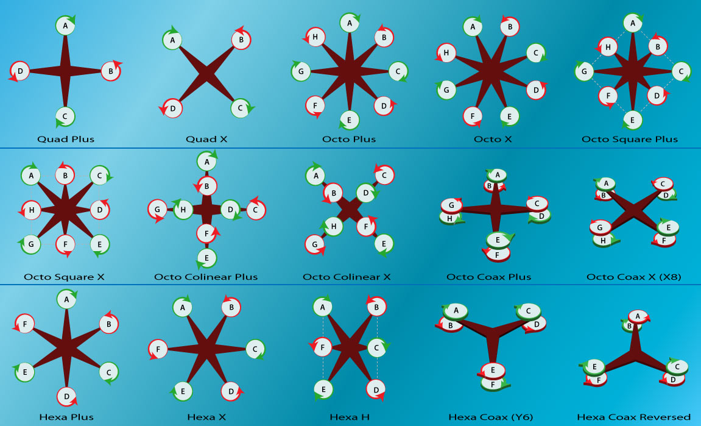
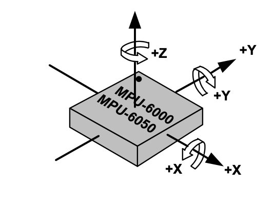

# Output Mixing
Before the output of the PID controller is useful it must be transformed into values for motors and servos.
To do this we use a mixer.

## Control Mixer
The function `controlMixer()` is where the mixing of RC channels and PID sums occurs. This is where the servo and motor commands are updated.

The function `controlMixer()` takes `float rc_channels[], float pidSums[], float motor_commands[], float servo_commands[]` as inputs.

`rc_channels[]` are all the RC channels being sent over your radio. Roll, pitch, and yaw have a range from -1.0 to 1.0. All other channels have a range from 0.0 to 1.0.

`pidSums[]` are the output of the Rate PID Controller. These values are used to mix stabilizing commands to the motors and servos.

`motor_commands[]` are the motor commands. The range is from 0.0 to 1.0. 

`servo_commands[]` are the servo commands. If set up properly the range is your control surface movement angles. 
When setup correctly control surface moving up is positive and down is negative values.

## Mixing It All Together
A positive roll PID sum should create a positive roll rotation.
A positive pitch PID sum should create a positive pitch rotation.
A positive yaw PID sum should create a positive yaw rotation.

Motors create a yaw torque opposite to the direction in which they spin.

As an example if we use have a Quad Plus setup shown below a potential mixer would look like:
```
float throttle = rc_channels[RC_THROTTLE];

float pitch_command = pidsum[AXIS_PITCH];
float roll_command = pidsum[AXIS_ROLL];
float yaw_command = pidsum[AXIS_YAW];

motor_commands[MOTOR_A] = throttle - pitch_command - yaw_command;
motor_commands[MOTOR_B] = throttle - roll_command + yaw_command;
motor_commands[MOTOR_C] = throttle + pitch_command - yaw_command;
motor_commands[MOTOR_D] = throttle + roll_command + yaw_command;
```

As an example if we have a wing setup shown below a potential mixer would look like:
```
float throttle = rc_channels[RC_THROTTLE];

float pitch_command = pidsum[AXIS_PITCH];
float roll_command = pidsum[AXIS_ROLL];
float yaw_command = pidsum[AXIS_YAW];

motor_commands[MOTOR_1] = throttle;
servo_commands[MOTOR_3] = pitch_command * 45.0f - roll_command * 45.0f; // the 45.0f relate to the maximum control surface movement
servo_commands[MOTOR_4] = pitch_command * 45.0f + roll_command * 45.0f; // the 45.0f relate to the maximum control surface movement
```




## Positive Rotation Direction Reminder

